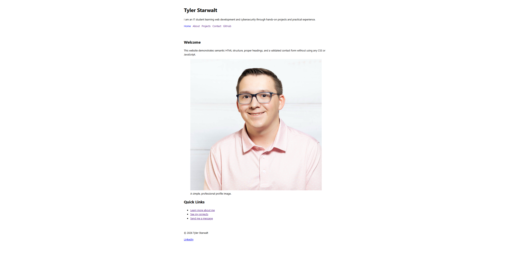

# Multi-page-website

A small, professional multi-page website built with semantic HTML and accessibility best practices. Includes responsive images, an embedded resource (iframe), consistent navigation/footer, and a validated contact form.

## Pages
- Home (`index.html`)
- About (`pages/about.html`)
- Projects (`pages/projects.html`)
- Contact (`pages/contact.html`)

## Features
- Semantic landmarks on every page (header, nav, main, footer)
- Exactly one h1 per page with correct heading order
- Responsive images (scale on mobile)
- Embedded media via iframe
- Accessible form (labels, required validation, fieldset + legend)

## Screenshot

## Live Site
GitHub Pages: [(My Site)](https://tstarwalt06.github.io/Multi-page-website))

